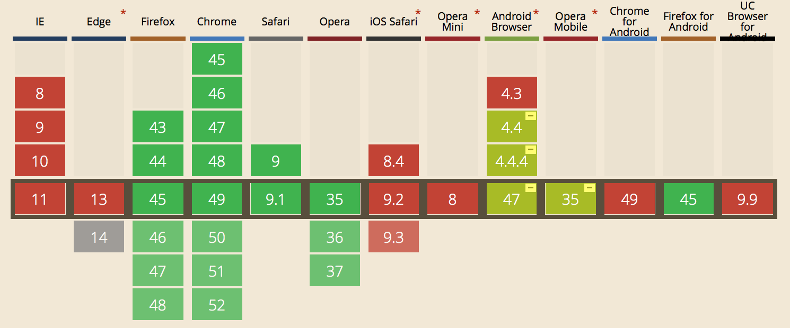

#Final Assignment - Browser Technologies
##Enhancement: Notifications API
The Notifications API is a great way to keep your user up-to-date on certain subjects, by sending them a web notification. For instance when his or her favorite football club has scored.

A problem with the Notifications API is that it's not that well supported, especially on movile devices. As can be seen on the screenshot from caniuse.com below.

##Use Case: I want to receive a notification if my favorite football team has won.
To build a demo for this use case, I followed the principle of **progressive enhancement**. This means that you build your website or application in three layers: HTML, CSS and finally JavaScript. I started out by creating the HTML for the website. By using semantically correct HTML and adding scores, the user can still see the result, even when they don't have any CSS or JavaScript. This is the most basic version of the application.

Then I started by adding some CSS to enhance the website and give it a more pleasant look. After this I started working on its enhanced feature: notifications. Because the notifications API is not well supported on mobile devices, the application starts out by checking whether or not it's supported. If it is, it will add a class to the body. Then it will check what kind of notification it has to send. The first notification, which will be used if the class isn't present on the body, is a hidden section which will be made visible. This section will show the matchup and the result from that match. As seen in the picture below;

If the class is present on the body, it will use the notification api. Sending a web notification to the user, providing information about the matchup as well as the result.
The notification (either one) will be sent when the user has pressed on one of the football clubs.

