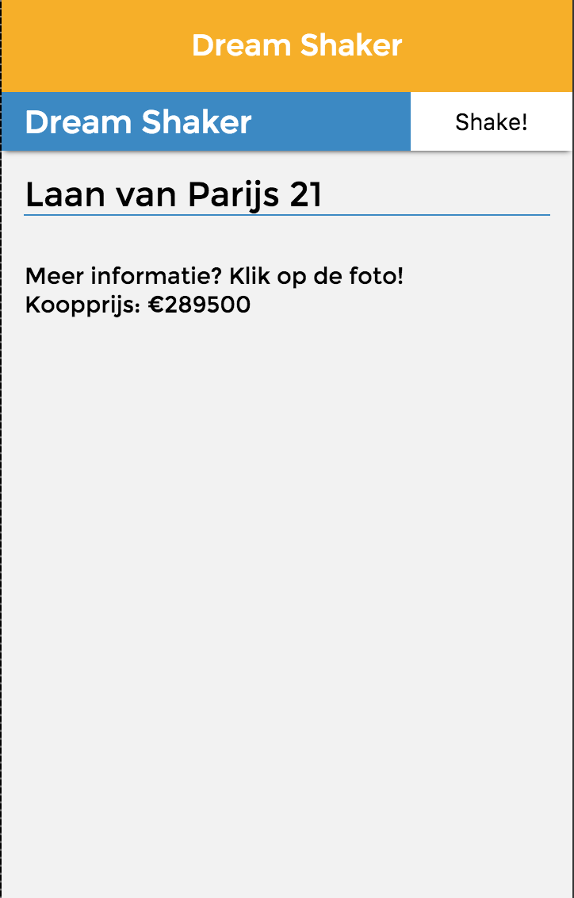

#Funda Application - Project 1
[Link to live site, this has to be watched in a cutting edge browser, like the latest Chrome](http://melvinr.github.io/Web%20App%20from%20Scratch/Eindopdracht/index.html)

#Browser Technologies 1.2 - Fork je Funda
##Feature 1 - Images
When turning off images on the Funda Shaker app, you will quickly notice that there is very little to see on a page. The only thing on the page is a little bit of information. Even though it is of course quite logical that there is not a lot to see on the page, since images are its main ingredient. There is room for improvement here. It is a shame that the space that was normally taken up by the images, has now fallen away, causing the information to move up to the top of the page. By adding a textual placeholder, you can provide extra information on the house. This shifts the main content of this page from images to textual information.

Another idea is to let the alt tag work its magic. Because it can provide great information on the image, and it lets the user know that something isn't right.

##Feature 2 - Total JavaScript blocking
The Funda Shaker app was mainly created using JavaScript. It gets data from funda's api and uses JavaScript templating to render the correct data in HTML. Since the project had to be finished in a week, there was not a lot of time to create fallbacks, which is why the page is blank when you launch the application.

One way to deal with deal with users turning off their JavaScript is the "noscript" tag. Within this tag you can give the user a message, alerting them that JavaScript is necessary for the application to work. Providing them enough information on the problem and how to fix it, instead of leaving them staring at just a blank screen.

A better way would be to rewrite the code in such a way that it isn't dependent on JavaScript to work. Server-side rendering might be a good way to achieve this. Taking the process of loading the JavaScript away from the user, and moving it to the server. This allows you to insert urls to the data, allowing the application to work without JavaScript.

##Feature 3 - Color
When it comes to design and functionality, colors can play a big role. They are a great way of giving visual feedback about elements. One big caveat though: how do you deal with users that don't see colors correctly? It's important to keep them in mind, since they use the web as well, and we should take them into account.

I've tested the Funda Shaker app using Q42's SEE plugin. As expected the page colors on the page change, giving it a different look. But the elements on the page are still easy to distinguish from one another, keeping the app's functionality intact.

##Feature 4 - Broadband internet
Since user nowadays often browse on their smartphones, it is important to take their internet speed into account. How long does it take for the application to load, and what happens when it takes a long time? Looking at the Funda Shaker, you will see that internet speed has some influence on the application. Since it has to get its data from an api, it might take some extra time loading the data. This isn't necessarily a big problem, but it is important to provide feedback to the user when waiting for the application to load. Funda Shaker uses its own loader to do this.

When it comes to response times there are 3 important limits. 1. When it takes up to 100ms, it is considered fast and there is no need to show a loader. 2 - After 1 second the user will begin to notice that he or she is waiting on something, but it's still fast enough to work without a loader. Take into account that the application will feel a bit slow. 3 - When it takes 10 seconds to load you are losing your user's attention. It is vital that you show the user feedback, by using a loader for example.

One downside on the shaker app is that you can actually see images rendering on the website. A way to fix this could be to render the images off screen, and have them transition into screen when it's done. This is of course only a good thing when the images don't take too long to load. Otherwise you will have to provide the user with feedback that loading is slow.

##Feature 5 - Cookies & localStorage
On the three big modern browsers (Chrome, Firefox and Safari) cookies and localStorage are partially treated the same. When cookies are blocked, localStorage is blocked as well. This behaviour can be a bad thing for websites or webapps, since some websites use localStorage to store data. Funda Shaker is no different, and works like this: a loader is shown when the application starts. It will try to get data from an api and store this in localStorage, then it will get this data from localStorage and render it to the correct HTML elements. By blocking cookies and/or localStorage the application will be in a loading loop from which it cannot escape. It is important to create fallbacks for this data to load when localStorage is not available. You can do this by  rendering the templates using http requests.

##Feature 6 - Mouse/trackpad doesn't work
It's also important to take into account how your website works without a mouse or trackpad. Some people browse websites using their keyboard, so you have to provide them with a way to this this. Funda Shaker still works perfectly without a mouse or trackpad. Allowing users to tab between the important elements on the page (like buttons or links).

##Feature 7 - Wifi Hotspots
When using wifi hotspots you put yourself at risk. Some wifi hotspots inject your website with a script containing ads or worse. An easy fix for this is to serve your website using https instead of http. Funda shaker is currently served on http and should, for security's sake, be served using https. Making it safe to use on wifi hotspots

#Screenreader
##Header
When going through Funda Shaker with a screenreader, you will notice that its main functionality stays intact. It recognizes the Shake button and gives feedback on what it is.

The logo should be given a link to the homepage. This gives the user a simple way to go back to the beginning, and it allows the screenreader to read and recognize the logo.

##Content
When the user tabs to the image it is recognized as both an image and a link. It reads the name of the image out loud. A problem with this is that it doesn't really give the user feedback on what the image actually is. Providing the images with the alt attribute you can give the user information on the image.

